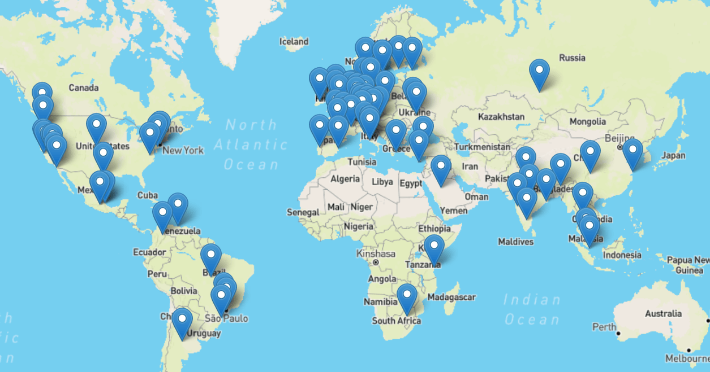

# Contributors map

The `build_contributors_html_page.py` script queries the GitHub v3 API
in order to generate the web page `contributors.html` with all the locations
of `fpdf2` contributors that included such information on their profile page.

Then the `contributors.html` page uses [LeafletJS](https://leafletjs.com)
and [Leaflet Control Geocoder](https://github.com/perliedman/leaflet-control-geocoder)
in order to place all contributors on a world map.

As of june 2021, the map looks like this (click on it to access the up-to-date online version):

The page is built by the [GitHub Actions pipeline](https://github.com/py-pdf/fpdf2/blob/master/.github/workflows/continuous-integration-workflow.yml#L62)
on every push on the `master` branch, and deployed on the project dedicated [GitHub page](https://pages.github.com).

The code in this directory can be freely re-used.
It is under [CC-0 license](https://creativecommons.org/publicdomain/zero/1.0/deed.en).
