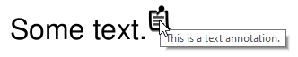
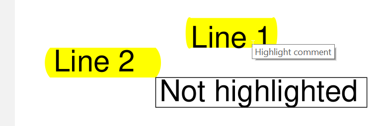

# Annotations #

The PDF format allows to add various annotations to a document.


## Text annotations ##

They are rendered this way by Sumatra PDF reader:



```python
from fpdf import FPDF

pdf = FPDF()
pdf.add_page()
pdf.set_font("Helvetica", size=24)
pdf.text(x=60, y=140, txt="Some text.")
pdf.text_annotation(
    x=100,
    y=130,
    text="This is a text annotation.",
)
pdf.output("text_annotation.pdf")
```

Method documentation: [`FPDF.text_annotation`](https://pyfpdf.github.io/fpdf2/fpdf/fpdf.html#fpdf.fpdf.FPDF.text_annotation)


## Highlights ##

```python
from fpdf import FPDF

pdf = FPDF()
pdf.add_page()
pdf.set_font("Helvetica", size=24)
with pdf.add_highlight("Highlight comment"):
    pdf.text(50, 50, "Line 1")
    pdf.set_y(50)
    pdf.multi_cell(w=30, txt="Line 2")
pdf.cell(w=60, txt="Not highlighted", border=1)
pdf.output("highlighted.pdf")
```

Rendering by Sumatra PDF reader:


Method documentation: [`FPDF.add_highlight`](https://pyfpdf.github.io/fpdf2/fpdf/fpdf.html#fpdf.fpdf.FPDF.add_highlight)


## Named actions ##

The four standard PDF named actions provide some basic navigation relative to the current page:
`NextPage`, `PrevPage`, `FirstPage` and `LastPage`.

```python
from fpdf import FPDF
from fpdf.actions import NamedAction

pdf = FPDF()
pdf.set_font("Helvetica", size=24)
pdf.add_page()
pdf.text(x=80, y=140, txt="First page")
pdf.add_page()
pdf.underline = True
for x, y, named_action in ((40, 80, "NextPage"), (120, 80, "PrevPage"), (40, 200, "FirstPage"), (120, 200, "LastPage")):
    pdf.text(x=x, y=y, txt=named_action)
    pdf.add_action(
        NamedAction(named_action),
        x=x,
        y=y - pdf.font_size,
        w=pdf.get_string_width(named_action),
        h=pdf.font_size,
    )
pdf.underline = False
pdf.add_page()
pdf.text(x=80, y=140, txt="Last page")
pdf.output("named_actions.pdf")
```


## Launch actions ##

Used to launch an application or open or print a document:

```python
from fpdf import FPDF
from fpdf.actions import LaunchAction

pdf = FPDF()
pdf.set_font("Helvetica", size=24)
pdf.add_page()
x, y, text = 80, 140, "Launch action"
pdf.text(x=x, y=y, txt=text)
pdf.add_action(
    LaunchAction("another_file_in_same_directory.pdf"),
    x=x,
    y=y - pdf.font_size,
    w=pdf.get_string_width(text),
    h=pdf.font_size,
)
pdf.output("launch_action.pdf")
```
