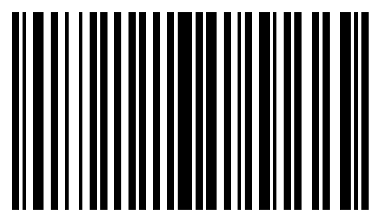

# Barcodes #

## Code 39 ##

Here is an example on how to generate a [Code 39](https://fr.wikipedia.org/wiki/Code_39) barcode:

```python
from fpdf import FPDF

pdf = FPDF()
pdf.add_page()
pdf.code39("*fpdf2*", x=30, y=50, w=4, h=20)
pdf.output("code39.pdf")
```

Output preview:


## Interleaved 2 of 5 ##

Here is an example on how to generate an [Interleaved 2 of 5](https://en.wikipedia.org/wiki/Interleaved_2_of_5) barcode:

```python
from fpdf import FPDF

pdf = FPDF()
pdf.add_page()
pdf.interleaved2of5("1337", x=50, y=50, w=4, h=20)
pdf.output("interleaved2of5.pdf")
```

Output preview:


## PDF-417 ##

Here is an example on how to generate a [PDF-417](https://fr.wikipedia.org/wiki/PDF-417) barcode
using the [`pdf417`](https://github.com/mosquito/pdf417) lib:

```python
from fpdf import FPDF
from pdf417 import encode, render_image

pdf = FPDF()
pdf.add_page()
img = render_image(encode("Lorem ipsum dolor sit amet, consectetur adipiscing elit. Sed non risus. Suspendisse lectus tortor, dignissim sit amet, adipiscing nec, ultricies sed, dolor. Cras elementum ultrices diam."))
pdf.image(img, x=10, y=50)
pdf.output("pdf417.pdf")
```

Output preview:


## QRCode ##

Here is an example on how to generate a [QR Code](https://en.wikipedia.org/wiki/QR_code)
using the [`python-qrcode`](https://github.com/lincolnloop/python-qrcode) lib:

```python
from fpdf import FPDF
import qrcode

pdf = FPDF()
pdf.add_page()
img = qrcode.make("fpdf2")
pdf.image(img.get_image(), x=50, y=50)
pdf.output("qrcode.pdf")
```

Output preview:


## DataMatrix ##

`fpdf2` can be combined with the [`pystrich`](https://github.com/mmulqueen/pyStrich) library to generate [DataMatrix barcodes](https://en.wikipedia.org/wiki/Data_Matrix):
`pystrich` generates pilimages, which can then be inserted into the PDF file via the `FPDF.image()` method.

```python
from fpdf import FPDF
from pystrich.datamatrix import DataMatrixEncoder, DataMatrixRenderer


# Define the properties of the barcode
positionX = 10
positionY = 10
width = 57
height = 57
cellsize = 5

# Prepare the datamatrix renderer that will be used to generate the pilimage
encoder = DataMatrixEncoder("[Text to be converted to a datamatrix barcode]")
encoder.width = width
encoder.height = height
renderer = DataMatrixRenderer(encoder.matrix, encoder.regions)

# Generate a pilimage and move it into the memory stream
img = renderer.get_pilimage(cellsize)

# Draw the barcode image into a PDF file
pdf = FPDF()
pdf.add_page()
pdf.image(img, positionX, positionY, width, height)
```


### Extend FPDF with a datamatrix() method ###

The code above could be added to the FPDF class as an extension method in the following way:

```python
from fpdf import FPDF
from pystrich.datamatrix import DataMatrixEncoder, DataMatrixRenderer

class PDF(FPDF):
    def datamatrix(self, text, w, h=None, x=None, y=None, cellsize=5):
        if x is None: x = self.x
        if y is None: y = self.y
        if h is None: h = w
        encoder = DataMatrixEncoder(text)
        encoder.width = w
        encoder.height = h
        renderer = DataMatrixRenderer(encoder.matrix, encoder.regions)
        img = renderer.get_pilimage(cellsize)
        self.image(img, x, y, w, h)

# Usage example:
pdf = PDF()
pdf.add_page()
pdf.set_font("Helvetica", size=24)
pdf.datamatrix("Hello world!", w=100)
pdf.output("datamatrix.pdf")
```

## Code128 ##

Here is an example on how to generate a [Code 128](https://en.wikipedia.org/wiki/Code_128) barcode
using the [`python-barcode`](https://github.com/WhyNotHugo/python-barcode) lib:

```
from io import BytesIO
from fpdf import FPDF
from barcode import Code128
from barcode.writer import SVGWriter

# Create a new PDF document
pdf = FPDF()
pdf.add_page()

# Set the position and size of the image in the PDF
x = 50
y = 50
w = 100
h = 70

# Generate a Code128 Barcode
byte_stream_object = BytesIO()
Code128(str("100000902922"), writer=SVGWriter()).write(byte_stream_object)
pdf.image(byte_stream_object, x=x, y=y, w=w, h=h)

# Output a PDF named code128_barcode.pdf
pdf.output('code128_barcode.pdf')
```

Output Preview:


