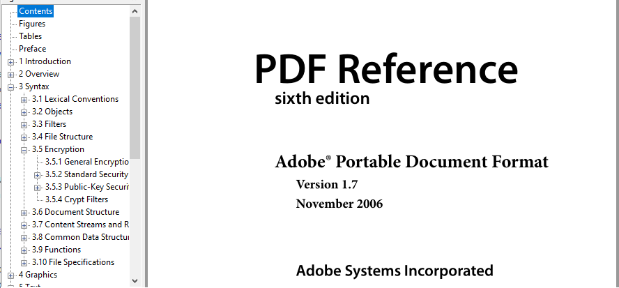

# Document outline & table of contents #

Quoting [Wikipedia](https://en.wikipedia.org/wiki/Table_of_contents), a **table of contents** is:
> a list, usually found on a page before the start of a written work, of its chapter or section titles or brief descriptions with their commencing page numbers.

Now quoting the 6th edition of the PDF format reference (v1.7 - 2006) :
> A PDF document may optionally display a **document outline** on the screen, allowing the user to navigate interactively
> from one part of the document to another. The outline consists of a tree-structured hierarchy of outline items
> (sometimes called bookmarks), which serve as a visual table of contents to display the document’s structure to the user.

For example, there is how a document outline looks like in [Sumatra PDF Reader](https://www.sumatrapdfreader.org/free-pdf-reader.html):



Since `fpdf2.3.3`, both features are supported through the use of the [`start_section`](fpdf/fpdf.html#fpdf.fpdf.FPDF.start_section) method,
that adds an entry in the internal "outline" table used to render both features.

Note that by default, calling `start_section` only records the current position in the PDF and renders nothing.
However, you can configure **global title styles** by calling [`set_section_title_styles`](fpdf/fpdf.html#fpdf.fpdf.FPDF.set_section_title_styles),
after which call to `start_section` will render titles visually using the styles defined.

To provide a document outline to the PDF you generate, you just have to call the `start_section` method
for every hierarchical section you want to define.

If you also want to insert a table of contents somewhere,
call [`insert_toc_placeholder`](fpdf/fpdf.html#fpdf.fpdf.FPDF.insert_toc_placeholder)
wherever you want to put it.
Note that a page break will always be triggered after inserting the table of contents.

## With HTML ##

When using [`fpdf.HTMLMixin`](HTML.md), a document outline is automatically built.
You can insert a table of content with the special `<toc>` tag.

Custom styling of the table of contents can be achieved by overriding the `render_toc` method
in a subclass of `fpdf.html.HTML2FPDF`:
```python
from fpdf import FPDF, HTMLMixin, HTML2FPDF

class CustomHTML2FPDF(HTML2FPDF):
    def render_toc(self, pdf, outline):
        pdf.cell(txt='Table of contents:', new_x="LMARGIN", new_y="NEXT")
        for section in outline:
            pdf.cell(txt=f'* {section.name} (page {section.page_number})', new_x="LMARGIN", new_y="NEXT")

class PDF(FPDF, HTMLMixin):
    HTML2FPDF_CLASS = CustomHTML2FPDF

pdf = PDF()
pdf.add_page()
pdf.write_html("""<toc></toc>
    <h1>Level 1</h1>
    <h2>Level 2</h2>
    <h3>Level 3</h3>
    <h4>Level 4</h4>
    <h5>Level 5</h5>
    <h6>Level 6</h6>
    <p>paragraph<p>""")
pdf.output("html_toc.pdf")
```

## Code samples ##

The regression tests are a good place to find code samples.

For example, the [`test_simple_outline`](https://github.com/PyFPDF/fpdf2/blob/master/test/outline/test_outline.py) test function generates the PDF document [test_simple_outline.pdf](https://github.com/PyFPDF/fpdf2/blob/master/test/outline/test_simple_outline.pdf).

Similarly, [`test_html_toc`](https://github.com/PyFPDF/fpdf2/blob/master/test/outline/test_outline_html.py)
generates [test_html_toc.pdf](https://github.com/PyFPDF/fpdf2/blob/5453422bf560a909229c82e53eb516e44fea1817/test/outline/test_html_toc.pdf).
