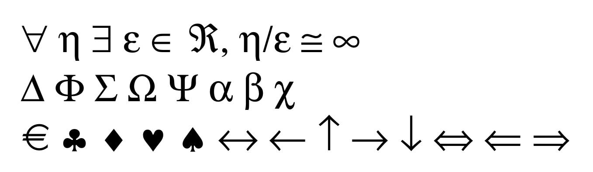
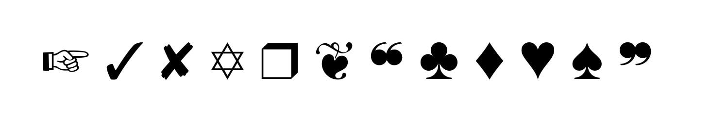

# Emojis, Symbols & Dingbats #

[TOC]

## Emojis ##

Displaying emojis requires the use of a [Unicode](Unicode.md) font file.
Here is an example using the [DejaVu](https://dejavu-fonts.github.io) font:

```python
import fpdf

pdf = fpdf.FPDF()
pdf.add_font("DejaVuSans", fname="DejaVuSans.ttf")
pdf.set_font("DejaVuSans", size=64)
pdf.add_page()
pdf.multi_cell(0, txt="".join([chr(0x1F600 + x) for x in range(68)]))
pdf.set_font_size(32)
pdf.text(10, 270, "".join([chr(0x1F0A0 + x) for x in range(15)]))
pdf.output("fonts_emoji_glyph.pdf")
```

This code produces this PDF file: [fonts_emoji_glyph.pdf](https://github.com/PyFPDF/fpdf2/blob/master/test/fonts/fonts_emoji_glyph.pdf)

## Symbols ##

The **Symbol** font is one of the built-in fonts in the PDF format.
Hence you can include its symbols very easily:

```python
import fpdf

pdf = fpdf.FPDF()
pdf.add_page()
pdf.set_font("symbol", size=36)
pdf.cell(h=16, txt="\u0022 \u0068 \u0024 \u0065 \u00ce \u00c2, \u0068/\u0065 \u0040 \u00a5",
        new_x=XPos.LMARGIN, new_y=YPos.NEXT)
pdf.cell(h=16, txt="\u0044 \u0046 \u0053 \u0057 \u0059 \u0061 \u0062 \u0063",
        new_x=XPos.LMARGIN, new_y=YPos.NEXT)
pdf.cell(h=16, txt="\u00a0 \u00a7 \u00a8 \u00a9 \u00aa \u00ab \u00ac \u00ad \u00ae \u00af \u00db \u00dc \u00de",
        new_x=XPos.LMARGIN, new_y=YPos.NEXT)
pdf.output("symbol.pdf")
```

This results in:


The following table will help you find which characters map to which symbol: [symbol.pdf](symbol.pdf).
For reference, it was built using this script: [symbol.py](symbol.py).

## Dingbats ##

The **ZapfDingbats** font is one of the built-in fonts in the PDF format.
Hence you can include its [dingbats](https://en.wikipedia.org/wiki/Dingbat) very easily:

```python
import fpdf

pdf = fpdf.FPDF()
pdf.add_page()
pdf.set_font("zapfdingbats", size=36)
pdf.cell(txt="+ 3 8 A r \u00a6 } \u00a8 \u00a9 \u00aa \u00ab ~")
pdf.output("zapfdingbat.pdf")
```

This results in:


The following table will help you find which characters map to which dingbats: [zapfdingbats.pdf](zapfdingbats.pdf).
For reference, it was built using this script: [zapfdingbats.py](zapfdingbats.py).
