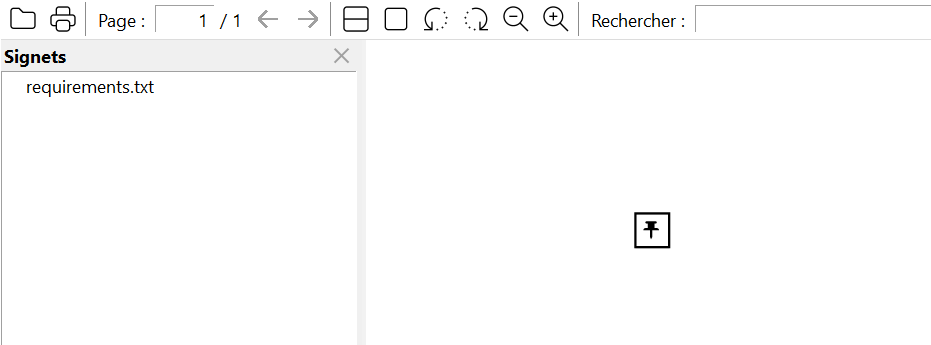

# File attachments #

## Embedded file streams

> Embedded file streams [allow] the contents of referenced files to be embedded directly within the body of the PDF
file. This makes the PDF file a self-contained unit that can be stored or transmitted as a single entity.

`fpdf2` gives access to this feature through the method [`embed_file()`](fpdf/fpdf.html#fpdf.fpdf.FPDF.embed_file):

```python
pdf = FPDF()
pdf.add_page()
pdf.embed_file(__file__, desc="Source Python code", compress=True)
pdf.output("embedded_file.pdf")
```

## Annotations

> A file attachment annotation contains a reference to a file, which typically shall be embedded in the
PDF file.

`fpdf2` gives access to this feature through the method [`file_attachment_annotation()`](fpdf/fpdf.html#fpdf.fpdf.FPDF.file_attachment_annotation):

```python
pdf = FPDF()
pdf.add_page()
pdf.file_attachment_annotation(__file__, x=50, y=50)
pdf.output("file_attachment_annotation.pdf")
```

Resulting PDF: [file_attachment_annotation.pdf](https://github.com/PyFPDF/fpdf2/blob/master/test/file_attachment_annotation.pdf)

Browser PDF viewers do not usually display embedded files & file attachment annotations,
so you may want to download this file and open it with your desktop PDF viewer in order to visualize the file attachments.


