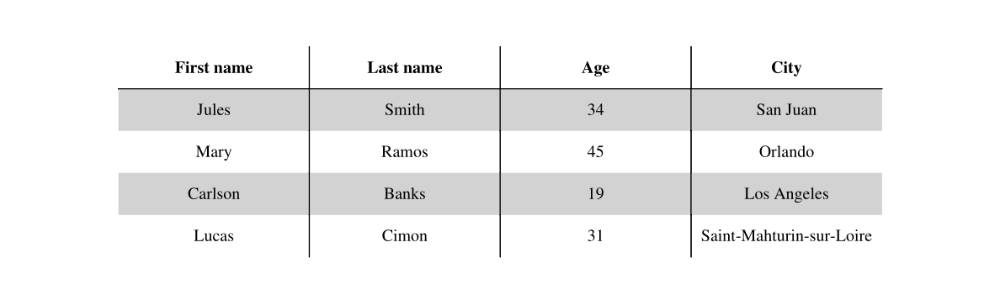
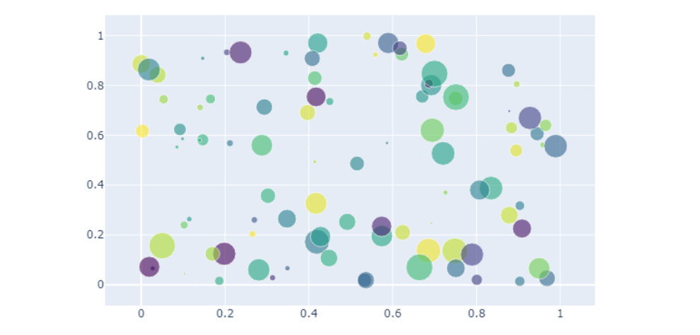
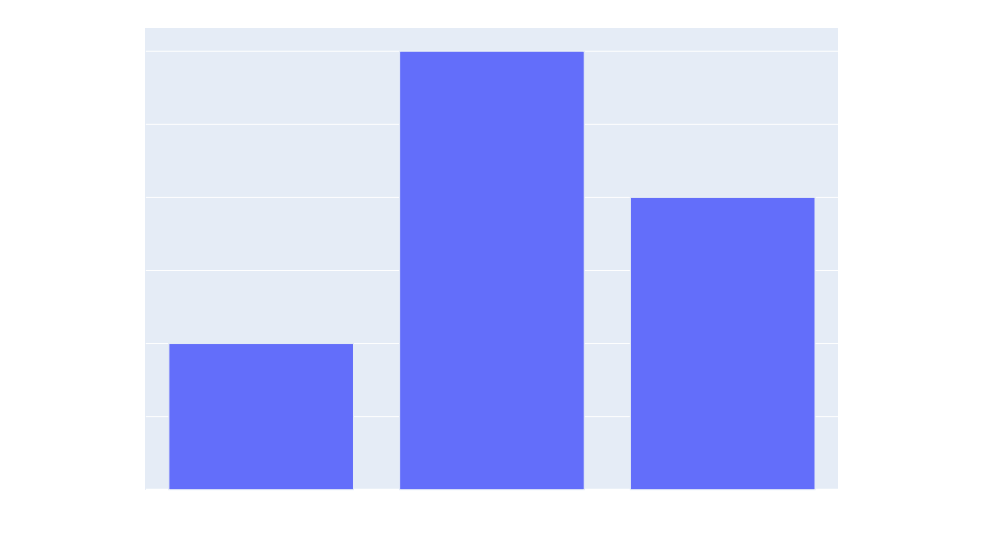

# Charts & graphs #

## Charts ##

### Using Matplotlib ###
Before running this example, please install the required dependencies using the command below:
```
pip install fpdf2 matplotlib
```
Example taken from [Matplotlib artist tutorial](https://matplotlib.org/stable/tutorials/intermediate/artists.html):

```python

```

Result:


You can also embed a figure as [SVG](SVG.md):

```python
from fpdf import FPDF
import matplotlib.pyplot as plt
import numpy as np

plt.figure(figsize=[2, 2])
x = np.arange(0, 10, 0.00001)
y = x*np.sin(2* np.pi * x)
plt.plot(y)
plt.savefig("figure.svg", format="svg")

pdf = FPDF()
pdf.add_page()
pdf.image("figure.svg")
pdf.output("doc-with-figure.pdf")
```

### Using Pandas ###
The dependencies required for the following examples can be installed using this command:
```
pip install fpdf2 matplotlib pandas
```

Create a plot using [pandas.DataFrame.plot](https://pandas.pydata.org/docs/reference/api/pandas.DataFrame.plot.html):

```python

```

Result:


Create a table with pandas [DataFrame](https://pandas.pydata.org/docs/reference/api/pandas.DataFrame.html):

```python

```

Result:


### Using Plotly ###

Before running this example, please install the required dependencies using the command below:

```
pip install fpdf2 plotly kaleido numpy
```

[kaleido](https://pypi.org/project/kaleido/) is a cross-platform library for generating static images that is used by plotly.

Example taken from [Plotly static image export tutorial](https://plotly.com/python/static-image-export/):

```python

```

Result:



You can also embed a figure as [SVG](SVG.md) but this is not recommended because the text data such as the x and y axis bars might not show as illustrated in the result image because plotly places this data in a svg text tag which is currently [not supported](https://github.com/py-pdf/fpdf2/issues/537) by FPDF2.

Before running this example, please install the required dependencies:

```
pip install fpdf2 plotly kaleido pandas
```

```python

```

Result:




### Using Pygal ###
[Pygal](https://www.pygal.org/en/stable/) is a Python graph plotting library.
You can install it using: `pip install pygal`

`fpdf2` can embed graphs and charts generated using `Pygal` library. However, they cannot be embedded as SVG directly, because `Pygal` inserts `<style>` & `<script>` tags in the images it produces (_cf._ [`pygal/svg.py`](https://github.com/Kozea/pygal/blob/3.0.0/pygal/svg.py#L449)), which is currently not supported by `fpdf2`.
The full list of supported & unsupported SVG features can be found there: [SVG page](SVG.md#supported-svg-features).

You can find documentation on how to convert vector images (SVG) to raster images (PNG, JPG), with a practical example of embedding PyGal charts, there:
[SVG page](SVG.md#converting-vector-graphics-to-raster-graphics).


## Mathematical formulas ##
`fpdf2` can only insert mathematical formula in the form of **images**.
The following sections will explaing how to generate and embed such images.

### Using Google Charts API ###
Official documentation: [Google Charts Infographics - Mathematical Formulas](https://developers.google.com/chart/infographics/docs/formulas).

Example:

```python

```

Result:


### Using LaTeX & Matplotlib ###
Matplotlib can render **LaTeX**: [Text rendering With LaTeX](https://matplotlib.org/stable/tutorials/text/usetex.html).

Example:

```python

```

Result:


If you have trouble with the SVG export, you can also render the matplotlib figure as pixels:

```python

```
