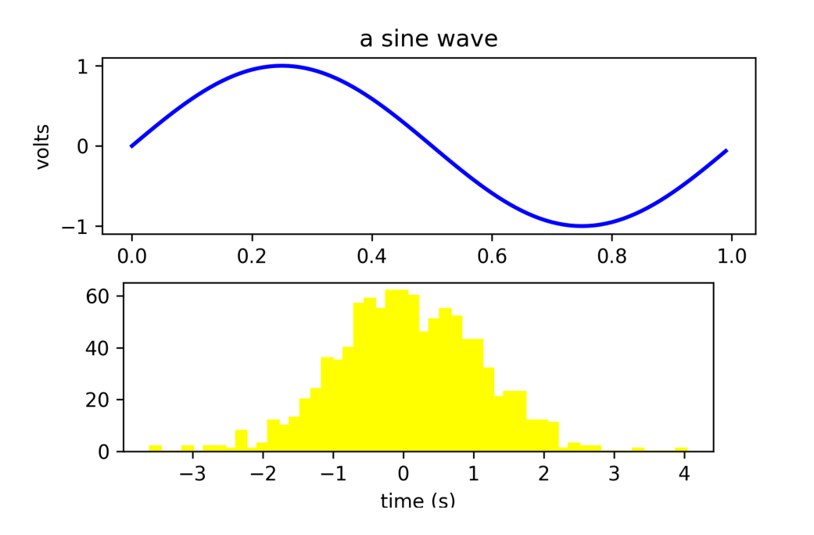
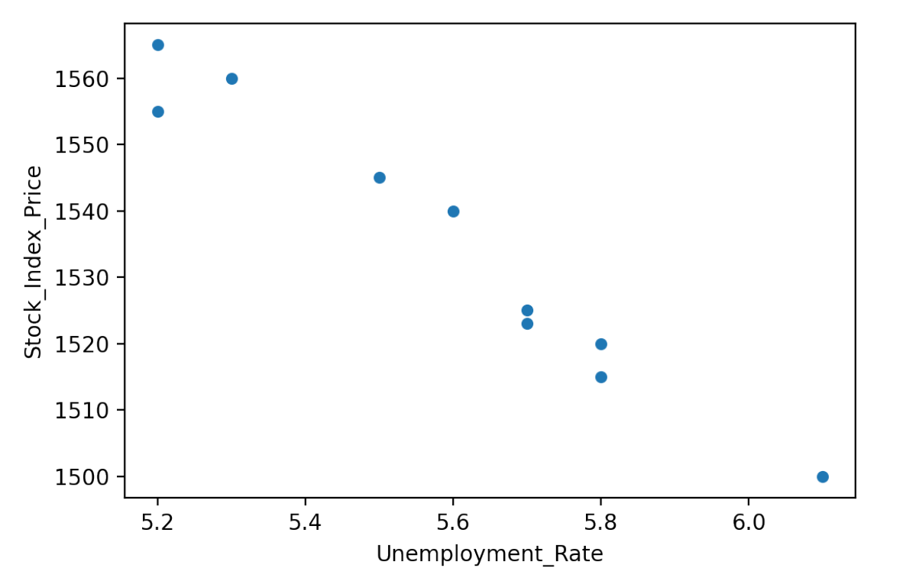
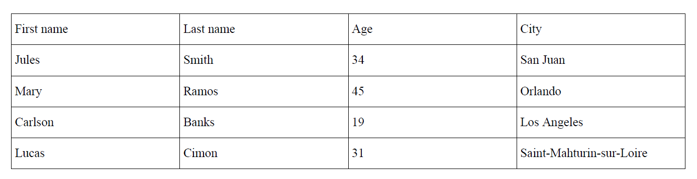
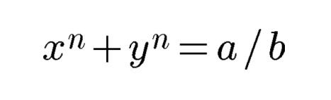
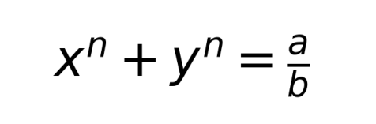

# Charts & graphs #


## Charts ##

### Using Matplotlib ###
Before running this example, please install the required dependencies using the command below:
```
pip install fpdf2 matplotlib
```
Example taken from [Matplotlib artist tutorial](https://matplotlib.org/stable/tutorials/intermediate/artists.html):

```python
from fpdf import FPDF
from matplotlib.backends.backend_agg import FigureCanvasAgg as FigureCanvas
from matplotlib.figure import Figure
import numpy as np
from PIL import Image

fig = Figure(figsize=(6, 4), dpi=300)
fig.subplots_adjust(top=0.8)
ax1 = fig.add_subplot(211)
ax1.set_ylabel("volts")
ax1.set_title("a sine wave")

t = np.arange(0.0, 1.0, 0.01)
s = np.sin(2 * np.pi * t)
(line,) = ax1.plot(t, s, color="blue", lw=2)

# Fixing random state for reproducibility
np.random.seed(19680801)

ax2 = fig.add_axes([0.15, 0.1, 0.7, 0.3])
n, bins, patches = ax2.hist(
    np.random.randn(1000), 50, facecolor="yellow", edgecolor="yellow"
)
ax2.set_xlabel("time (s)")

# Converting Figure to an image:
canvas = FigureCanvas(fig)
canvas.draw()
img = Image.fromarray(np.asarray(canvas.buffer_rgba()))

pdf = FPDF()
pdf.add_page()
pdf.image(img, w=pdf.epw)  # Make the image full width
pdf.output("matplotlib.pdf")
```

Result:



### Using Pandas ###
The dependencies required for the following examples can be installed using this command:
```
pip install fpdf2 matplotlib pandas
```

Create a plot using [pandas.DataFrame.plot](https://pandas.pydata.org/docs/reference/api/pandas.DataFrame.plot.html):
```python
from fpdf import FPDF
import pandas as pd
import matplotlib.pyplot as plt
import io

data = {
    "Unemployment_Rate": [6.1, 5.8, 5.7, 5.7, 5.8, 5.6, 5.5, 5.3, 5.2, 5.2],
    "Stock_Index_Price": [1500, 1520, 1525, 1523, 1515, 1540, 1545, 1560, 1555, 1565],
}

plt.figure()  # Create a new figure object
df = pd.DataFrame(data, columns=["Unemployment_Rate", "Stock_Index_Price"])
df.plot(x="Unemployment_Rate", y="Stock_Index_Price", kind="scatter")

# Converting Figure to an image:
img_buf = io.BytesIO()  # Create image object
plt.savefig(img_buf, dpi=200)  # Save the image

pdf = FPDF()
pdf.add_page()
pdf.image(img_buf, w=pdf.epw) # Make the image full width
pdf.output("pandas.pdf")
img_buf.close()
```
Result:




Create a table with pandas [DataFrame](https://pandas.pydata.org/docs/reference/api/pandas.DataFrame.html):
```python
from fpdf import FPDF
import pandas as pd

df = pd.DataFrame(
    {
        "First name": ["Jules", "Mary", "Carlson", "Lucas"],
        "Last name": ["Smith", "Ramos", "Banks", "Cimon"],
        "Age": [34, 45, 19, 31],
        "City": ["San Juan", "Orlando", "Los Angeles", "Saint-Mahturin-sur-Loire"],
    }
)

df = df.applymap(str)  # Convert all data inside dataframe into string type

columns = [list(df)]  # Get list of dataframe columns
rows = df.values.tolist()  # Get list of dataframe rows
data = columns + rows  # Combine columns and rows in one list

# Start pdf creating
pdf = FPDF()
pdf.add_page()
pdf.set_font("Times", size=10)
line_height = pdf.font_size * 2.5
col_width = pdf.epw / 4  # distribute content evenly

for row in data:
    for datum in row:
        pdf.multi_cell(
            col_width,
            line_height,
            datum,
            border=1,
            new_y="TOP",
            max_line_height=pdf.font_size,
        )
    pdf.ln(line_height)
pdf.output("table_with_cells.pdf")
```

Result:



## Mathematical formulas ##
`fpdf2` can only insert mathematical formula in the form of **images**.
The following sections will explaing how to generate and embed such images.

### Using Google Charts API ###
Official documentation: [Google Charts Infographics - Mathematical Formulas](https://developers.google.com/chart/infographics/docs/formulas).

Example:

```python
from io import BytesIO
from urllib.parse import quote
from urllib.request import urlopen
from fpdf import FPDF

formula = "x^n + y^n = a/b"
height = 170
url = f"https://chart.googleapis.com/chart?cht=tx&chs={height}&chl={quote(formula)}"
with urlopen(url) as img_file:
    img = BytesIO(img_file.read())

pdf = FPDF()
pdf.add_page()
pdf.image(img, w=30)
pdf.output("equation-with-gcharts.pdf")
```

Result:




### Using Matplotlib ###
Matplotlib can render **LaTeX**: [Text rendering With LaTeX](https://matplotlib.org/stable/tutorials/text/usetex.html).

Example:

```python
from fpdf import FPDF
from matplotlib.backends.backend_agg import FigureCanvasAgg as FigureCanvas
from matplotlib.figure import Figure
import numpy as np
from PIL import Image

fig = Figure(figsize=(6, 2), dpi=300)
axes = fig.gca()
axes.text(0, 0.5, r"$x^n + y^n = \frac{a}{b}$", fontsize=60)
axes.axis("off")

# Converting Figure to an image:
canvas = FigureCanvas(fig)
canvas.draw()
img = Image.fromarray(np.asarray(canvas.buffer_rgba()))

pdf = FPDF()
pdf.add_page()
pdf.image(img, w=100)
pdf.output("equation-with-matplotlib.pdf")
```

Result:


