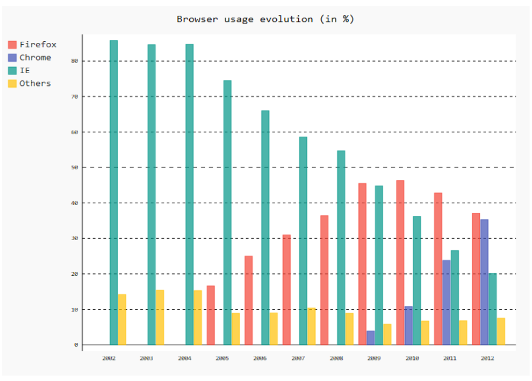
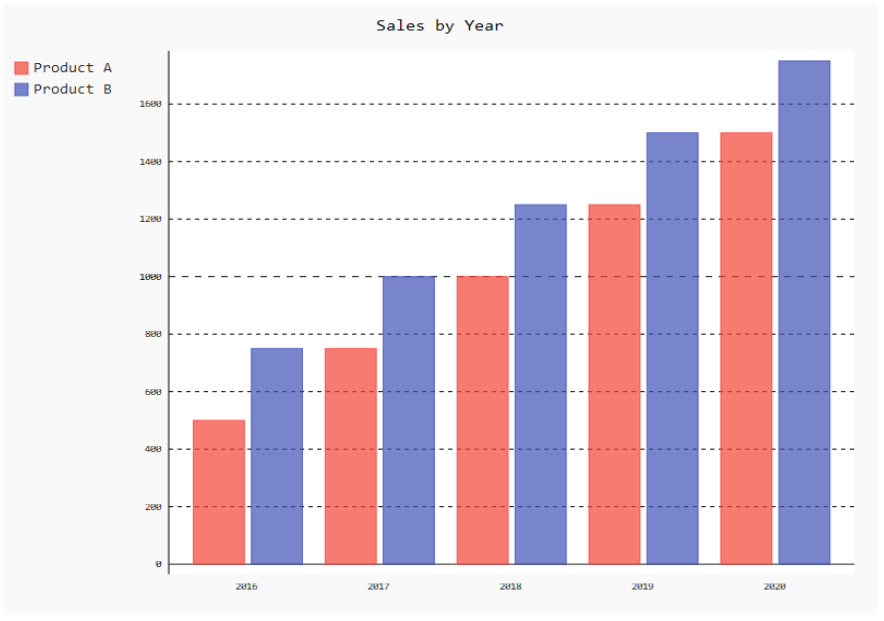

# Scalable Vector Graphics (SVG) #

`fpdf2` supports basic conversion of SVG paths into PDF paths, which can be
inserted into an existing PDF document or used as the contents of a new PDF
document.

Not all SVGs will convert correctly. Please see
[the list of unsupported features](#currently-unsupported-notable-svg-features)
for more information about what to look out for.

## Basic usage ##

SVG files can be directly inserted inside a PDF file using the [image()](fpdf/fpdf.html#fpdf.fpdf.FPDF.image) method:

```python
from fpdf import FPDF

pdf = FPDF()
pdf.add_page()
pdf.image("vector.svg")
pdf.output("doc-with-svg.pdf")
```

Either the embedded `.svg` file must includes `width` and/or `height` attributes (absolute or relative),
or some dimensions must be provided to `.image()` through its `w=` and/or `h=` parameters.

## Detailed example ##

The following script will create a PDF that consists only of the graphics
contents of the provided SVG file, filling the whole page:

```python
import fpdf

svg = fpdf.svg.SVGObject.from_file("my_file.svg")

pdf = fpdf.FPDF(unit="pt", format=(svg.width, svg.height))
pdf.add_page()
svg.draw_to_page(pdf)

pdf.output("my_file.pdf")
```

Because this takes the PDF document size from the source SVG, it does assume
that the width/height of the SVG are specified in absolute units rather than
relative ones (i.e. the top-level `<svg>` tag has something like `width="5cm"`
and not `width=50%`). In this case, if the values are percentages, they will be
interpreted as their literal numeric value (i.e. `100%` would be treated as `100 pt`).
The next example uses `transform_to_page_viewport`, which will scale
an SVG with a percentage based `width` to the pre-defined PDF page size.

The converted SVG object can be returned as an fpdf.drawing.GraphicsContext
collection of drawing directives for more control over how it is rendered:

```python
import fpdf

svg = fpdf.svg.SVGObject.from_file("my_file.svg")

pdf = FPDF(unit="in", format=(8.5, 11))
pdf.add_page()

# We pass align_viewbox=False because we want to perform positioning manually
# after the size transform has been computed.
width, height, paths = svg.transform_to_page_viewport(pdf, align_viewbox=False)
# note: transformation order is important! This centers the svg drawing at the
# origin, rotates it 90 degrees clockwise, and then repositions it to the
# middle of the output page.
paths.transform = paths.transform @ fpdf.drawing.Transform.translation(
    -width / 2, -height / 2
).rotate_d(90).translate(pdf.w / 2, pdf.h / 2)

pdf.draw_path(paths)

pdf.output("my_file.pdf")
```

## Converting vector graphics to raster graphics ##
Usually, embedding SVG as vector graphics in PDF documents is the best approach,
as it is both lightweight and will allow for better details / precision of the images inserted.

But sometimes, SVG images cannot be directly embedded as vector graphics (SVG),
and a conversion to raster graphics (PNG, JPG) must be performed.

The following sections demonstrate how to perform such conversion, using [Pygal charts](Maths.md#using-pygal) as examples:

### Using cairosvg ###
A faster and efficient approach for embedding `Pygal` SVG charts into a PDF file is to use the `cairosvg` library to convert the vector graphics generated into a `BytesIO` instance, so that we can keep these data in an in-memory buffer:

```python
import pygal
from fpdf import FPDF
from io import BytesIO
import cairosvg

# Create a Pygal bar chart
bar_chart = pygal.Bar()
bar_chart.title = 'Browser usage evolution (in %)'
bar_chart.x_labels = map(str, range(2002, 2013))
bar_chart.add('Firefox', [None, None, 0, 16.6,   25,   31, 36.4, 45.5, 46.3, 42.8, 37.1])
bar_chart.add('Chrome',  [None, None, None, None, None, None,    0,  3.9, 10.8, 23.8, 35.3])
bar_chart.add('IE',      [85.8, 84.6, 84.7, 74.5,   66, 58.6, 54.7, 44.8, 36.2, 26.6, 20.1])
bar_chart.add('Others',  [14.2, 15.4, 15.3,  8.9,    9, 10.4,  8.9,  5.8,  6.7,  6.8,  7.5])
svg_img = bar_chart.render()

# Convert the SVG chart to a PNG image in a BytesIO object
img_bytesio = BytesIO()
cairosvg.svg2png(svg_img, write_to=img_bytesio, dpi=96)

# Set the position and size of the image in the PDF
x = 50
y = 50
w = 100
h = 70

# Build the PDF
pdf = FPDF()
pdf.add_page()
pdf.image(img_bytesio, x=x, y=y, w=w, h=h)
pdf.output('browser-usage-bar-chart.pdf')
```
The above code generates a PDF with the following graph:


**!! Troubleshooting advice !!**

You may encounter `GTK` (Gnome Toolkit) errors while executing the above example in windows. Error could be like following -
```
OSError: no library called "cairo-2" was found
no library called "cairo" was found
no library called "libcairo-2" was found
cannot load library 'libcairo.so.2': error 0x7e
cannot load library 'libcairo.2.dylib': error 0x7e
cannot load library 'libcairo-2.dll': error 0x7e
```
In this case install install `GTK` from [GTK-for-Windows-Runtime-Environment-Installer](https://github.com/tschoonj/GTK-for-Windows-Runtime-Environment-Installer/releases). Restart your editor. And you are all done.

### Using svglib and reportlab ###
An alternative, purely pythonic but slightly slower solution is to use `reportlab` and `svglib`:

```python
import io
import pygal
from reportlab.graphics import renderPM
from svglib.svglib import SvgRenderer
from fpdf import FPDF
from lxml import etree

# Create a Pygal bar chart
bar_chart = pygal.Bar()
bar_chart.title = 'Sales by Year'
bar_chart.x_labels = ['2016', '2017', '2018', '2019', '2020']
bar_chart.add('Product A', [500, 750, 1000, 1250, 1500])
bar_chart.add('Product B', [750, 1000, 1250, 1500, 1750])
svg_img = bar_chart.render()

# Convert the SVG chart to a JPEG image in a BytesIO object
drawing = SvgRenderer('').render(etree.fromstring(svg_img))
jpg_img_bytes = renderPM.drawToString(drawing, fmt='JPG', dpi=72)
img_bytesio = io.BytesIO(jpg_img_bytes)

# Set the position and size of the image in the PDF
x = 50
y = 50
w = 100
h = 70

# Build the PDF
pdf = FPDF()
pdf.add_page()
pdf.image(img_bytesio, x=x, y=y, w=w, h=h)
pdf.output('sales-by-year-bar-chart.pdf')
```

The above code generates the following output:


**Performance considerations**

Regarding performance, `cairosvg` is generally faster than `svglib` when it comes to rendering SVG files to other formats. This is because `cairosvg` is built on top of a fast C-based rendering engine, while `svglib` is written entirely in Python, and hence a bit slower.
Additionally, `cairosvg` offers various options for optimizing the rendering performance, such as disabling certain features, like fonts or filters.


## Supported SVG Features ##

- groups
- paths
- basic shapes (rect, circle, ellipse, line, polyline, polygon)
- basic cross-references
- stroke & fill coloring and opacity
- basic stroke styling
- Inline CSS styling via `style="..."` attributes.

## Currently Unsupported Notable SVG Features ##

Everything not listed as supported is unsupported, which is a lot. SVG is a
ridiculously complex format that has become increasingly complex as it absorbs
more of the entire browser rendering stack into its specification. However,
there are some pretty commonly used features that are unsupported that may
cause unexpected results (up to and including a normal-looking SVG rendering as
a completely blank PDF). It is very likely that off-the-shelf SVGs will not be
converted fully correctly without some preprocessing.

In addition to that:

- text/tspan/textPath
- symbols
- markers
- patterns
- gradients
- a lot of attributes
- embedded images or other content (including nested SVGs)
- CSS styling via `<style>` tags or external *.css files.

{==

Contributions would be very welcome to add support for more SVG features! 👍

If you are interested in contributing to `fpdf2` regarding this,
drop a comment on GitHub issue [#537](https://github.com/PyFPDF/fpdf2/issues/537)
and a maintainer will give some pointers to start poking with the code 😊

==}
