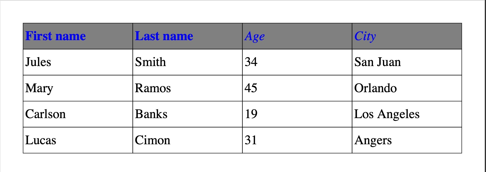
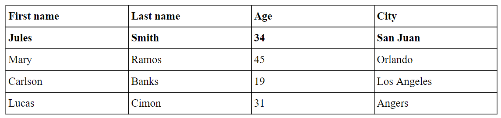

# Tables

_New in [:octicons-tag-24: 2.7.0](https://github.com/py-pdf/fpdf2/blob/master/CHANGELOG.md)_

Tables can be built using the `table()` method.
Here is a simple example:

```python
from fpdf import FPDF

TABLE_DATA = (
    ("First name", "Last name", "Age", "City"),
    ("Jules", "Smith", "34", "San Juan"),
    ("Mary", "Ramos", "45", "Orlando"),
    ("Carlson", "Banks", "19", "Los Angeles"),
    ("Lucas", "Cimon", "31", "Saint-Mahturin-sur-Loire"),
)
pdf = FPDF()
pdf.add_page()
pdf.set_font("Times", size=16)
with pdf.table() as table:
    for data_row in TABLE_DATA:
        row = table.row()
        for datum in data_row:
            row.cell(datum)
pdf.output('table.pdf')
```

Result:


## Features

* support cells with content wrapping over several lines
* control over column & row sizes (automatically computed by default)
* allow to style table headings (top row), or disable them
* control over borders: color, width & where they are drawn
* handle splitting a table over page breaks, with headings repeated
* control over cell background color
* control table width & position
* control over text alignment in cells, globally or per row
* allow to embed images in cells

## Setting table & column widths

```python
...
with pdf.table(width=150, col_widths=(30, 30, 10, 30)) as table:
    ...
```

Result:


`align` can be passed to `table()` to set the table horizontal position relative to the page,
when it's not using the full page width. It's centered by default.

## Setting text alignment

This can be set globally, or on a per-column basis:

```python
...
with pdf.table(text_align="CENTER") as table:
    ...
pdf.ln()
with pdf.table(text_align=("CENTER", "CENTER", "RIGHT", "LEFT")) as table:
    ...
```

Result:


## Setting cell padding

_New in [:octicons-tag-24: 2.7.6](https://github.com/PyFPDF/fpdf2/blob/master/CHANGELOG.md)_

Cell padding (the space between the cells content and the edge of the cell) can be set globally or on a per-cell basis.

Following the CCS standard the padding can be specified using 1,2 3 or 4 values.

- When one value is specified, it applies the same padding to all four sides.
- When two values are specified, the first padding applies to the top and bottom, the second to the left and right.
- When three values are specified, the first padding applies to the top, the second to the right and left, the third to
  the bottom.
- When four values are specified, the paddings apply to the top, right, bottom, and left in that order (clockwise)

```python
    ...
style = FontFace(color=black, fill_color=red)
with pdf.table(line_height=pdf.font_size, padding=2) as table:
    for irow in range(5):
        row = table.row()
        for icol in range(5):
            datum = "Circus"
            if irow == 3 and icol % 2 == 0:
                row.cell("custom padding", style=style, padding=(2 * icol, 8, 8, 8))
            else:
                row.cell(datum)
```

(also an example of coloring individual cells)


Note: the `c_margin` parameter (default 1.0) also controls the horizontal margins in a cell. If a non-zero padding for
left and right is supplied then c_margin is ignored.

## Setting vertical alignment of text in cells

_New in [:octicons-tag-24: 2.7.6](https://github.com/PyFPDF/fpdf2/blob/master/CHANGELOG.md)_

Can be set globally or per cell.
Works the same way as padding, but with the `v_align` parameter.

```python

with pdf.table(v_align=VAlign.M) as table:
    ...
    row.cell(f"custom v-align", v_align=VAlign.T)  # <-- align to top
```

## Setting row height

```python
...
with pdf.table(line_height=2.5 * pdf.font_size) as table:
    ...
```

## Disable table headings

```python
...
with pdf.table(first_row_as_headings=False) as table:
    ...
```

## Style table headings

```python
from fpdf.fonts import FontFace

...
blue = (0, 0, 255)
grey = (128, 128, 128)
headings_style = FontFace(emphasis="ITALICS", color=blue, fill_color=grey)
with pdf.table(headings_style=headings_style) as table:
    ...
```

Result:


It's possible to override the style of individual cells in the heading. The overriding style will take
precedence for any specified values, while retaining the default style for unspecified values:
```python
...
headings_style = FontFace(emphasis="ITALICS", color=blue, fill_color=grey)
override_style = FontFace(emphasis="BOLD")
with pdf.table(headings_style=headings_style) as table:
    headings = table.row()
    headings.cell("First name", style=override_style)
    headings.cell("Last name", style=override_style)
    headings.cell("Age")
    headings.cell("City")
    ...
```

Result:



## Set cells background

```python
...
greyscale = 200
with pdf.table(cell_fill_color=greyscale, cell_fill_mode="ROWS") as table:
    ...
```

Result:


```python
...
lightblue = (173, 216, 230)
with pdf.table(cell_fill_color=lightblue, cell_fill_mode="COLUMNS") as table:
    ...
```

Result:


The cell color is set following those settings, ordered by priority:

1. The cell `style`, provided to `Row.cell()`
2. The row `style`, provided to `Table.row()`
3. The table setting `headings_style.fill_color`, if the cell is part of some headings row
4. The table setting `cell_fill_color`, if `cell_fill_mode` indicates to fill a cell
5. The document `.fill_color` set before rendering the table


## Set borders layout

```python
...
with pdf.table(borders_layout="INTERNAL") as table:
    ...
```

Result:


```python
...
with pdf.table(borders_layout="MINIMAL") as table:
    ...
```

Result:


```python
...
pdf.set_draw_color(50)  # very dark grey
pdf.set_line_width(.5)
with pdf.table(borders_layout="SINGLE_TOP_LINE") as table:
    ...
```

Result:


All the possible layout values are described
there: [`TableBordersLayout`](https://py-pdf.github.io/fpdf2/fpdf/enums.html#fpdf.enums.TableBordersLayout).

## Insert images

```python
TABLE_DATA = (
    ("First name", "Last name", "Image", "City"),
    ("Jules", "Smith", "shirt.png", "San Juan"),
    ("Mary", "Ramos", "joker.png", "Orlando"),
    ("Carlson", "Banks", "socialist.png", "Los Angeles"),
    ("Lucas", "Cimon", "circle.bmp", "Angers"),
)
pdf = FPDF()
pdf.add_page()
pdf.set_font("Times", size=16)
with pdf.table() as table:
    for i, data_row in enumerate(TABLE_DATA):
        row = table.row()
        for j, datum in enumerate(data_row):
            if j == 2 and i > 0:
                row.cell(img=datum)
            else:
                row.cell(datum)
pdf.output('table_with_images.pdf')
```

Result:


By default, images height & width are constrained by the row height (based on text content)
and the column width. To render bigger images, you can set the `line_height` to increase the row height, or
pass `img_fill_width=True` to `.cell()`:

```python
                    row.cell(img=datum, img_fill_width=True)
```

Result:


## Adding links to cells

```python
                    row.cell(..., link="https://py-pdf.github.io/fpdf2/")
row.cell(..., link=pdf.add_link(page=1))
```

## Syntactic sugar

To simplify `table()` usage, shorter, alternative usage forms are allowed.

This sample code:

```python
with pdf.table() as table:
    for data_row in TABLE_DATA:
        row = table.row()
        for datum in data_row:
            row.cell(datum)
```

Can be shortened to the followng code,
by passing lists of strings as the `cells` optional argument of `.row()`:

```python
with pdf.table() as table:
    for data_row in TABLE_DATA:
        table.row(data_row)
```

And even shortened further to a single line,
by passing lists of lists of strings as the `rows` optional argument of `.table()`:

```python
with pdf.table(TABLE_DATA):
    pass
```

## Gutter

Spacing can be introduced between rows and/or columns:

```python
with pdf.table(TABLE_DATA, gutter_height=3, gutter_width=3):
    pass
```

Result:


## Column span

Cells spanning multiple columns can be defined by passing a `colspan` argument to `.cell()`.
Only the cells with data in them need to be defined. This means that the number of cells on each row can be different.

```python
    ...
with pdf.table(col_widths=(1, 2, 1, 1)) as table:
    row = table.row()
    row.cell("0")
    row.cell("1")
    row.cell("2")
    row.cell("3")

    row = table.row()
    row.cell("A1")
    row.cell("A2", colspan=2)
    row.cell("A4")

    row = table.row()
    row.cell("B1", colspan=2)
    row.cell("B3")
    row.cell("B4")
...
```

result:


## Table with multiple heading rows

The number of heading rows is defined by passing the `num_heading_rows` argument to `Table()`. The default value is `1`. To guarantee backwards compatibility with the `first_row_as_headings` argument, the following applies:
- If `num_heading_rows==1`: The value of `first_row_as_headings` defines whether the first row is treated as heading or standard row.
- Otherwise, the value of `num_heading_rows` decides the number of heading rows.
```python
with pdf.table(TABLE_DATA, num_heading_rows=2):
    pass
```

Result:



## Table from pandas DataFrame

_cf._ [Maths documentation page](Maths.md#using-pandas)

## Using write_html

Tables can also be defined in HTML using [`FPDF.write_html`](HTML.md).
With the same `data` as above, and column widths defined as percent of the effective width:

```python
from fpdf import FPDF

pdf = FPDF()
pdf.set_font_size(16)
pdf.add_page()
pdf.write_html(
    f"""<table border="1"><thead><tr>
    <th width="25%">{TABLE_DATA[0][0]}</th>
    <th width="25%">{TABLE_DATA[0][1]}</th>
    <th width="15%">{TABLE_DATA[0][2]}</th>
    <th width="35%">{TABLE_DATA[0][3]}</th>
</tr></thead><tbody><tr>
    <td>{'</td><td>'.join(TABLE_DATA[1])}</td>
</tr><tr>
    <td>{'</td><td>'.join(TABLE_DATA[2])}</td>
</tr><tr>
    <td>{'</td><td>'.join(TABLE_DATA[3])}</td>
</tr><tr>
    <td>{'</td><td>'.join(TABLE_DATA[4])}</td>
</tr></tbody></table>""",
    table_line_separators=True,
)
pdf.output('table_html.pdf')
```

Note that `write_html` has [some limitations, notably regarding multi-lines cells](HTML.md#supported-html-features).

## "Parsabilty" of the tables generated

The PDF file format is not designed to embed structured tables.
Hence, it can be tricky to extract tables data from PDF documents.

In our tests suite, we ensure that several PDF-tables parsing Python libraries can successfully extract tables in
documents generated with `fpdf2`.
Namely, we
test [camelot-py](https://camelot-py.readthedocs.io) & [tabula-py](https://tabula-py.readthedocs.io): [test/table/test_table_extraction.py](https://github.com/py-pdf/fpdf2/blob/master/test/table/test_table_extraction.py).

Based on those tests, if you want to ease table extraction from the documents you produce, we recommend the following
guidelines:

* avoid splitting tables on several pages
* avoid the `INTERNAL` / `MINIMAL` / `SINGLE_TOP_LINE` borders layouts
