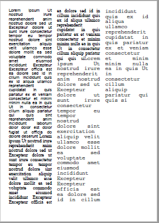

_New in [:octicons-tag-24: 2.7.6](https://github.com/py-pdf/fpdf2/blob/master/CHANGELOG.md)_

**Notice:** As of fpdf2 release 2.7.6, this is an experimental feature. Both the API and the functionality may change before it is finalized, without prior notice.


## Text Columns ##

The `FPDF.text_columns()` method allows to create columnar layouts, with one or several columns. Columns will always be of equal width.

### Parameters ###

Beyond the parameters common to all text regions, the following are available for text columns:

* l_margin (float, optional) - override the current left page margin.
* r_margin (float, optional) - override the current right page margin.
* ncols (float, optional) - the number of columns to generate (Default: 2).
* gutter (float, optional) - the horizontal space required between each two columns (Default 10).
* balance (bool, optional) - Create height balanced columns, starting at the current height and ending at approximately the same level.

### Methods ###

Text columns support all the standard text region methods like `.paragraph()`, `.write()`, `.ln()`, and `.render()`. In addition to that:

* `.new_column()` - End the current column and continue at the top of the next one.

A FORM_FEED character (`\u000c`) in the text will have the same effect as an explicit call to `.new_column()`,

Note that when used within balanced columns, switching to a new column manually will result in incorrect balancing.


#### Single-Column Example ####

In this example an inserted paragraph is used in order to format its content with justified alignment, while the rest of the text uses the default left alignment.

```python
from fpdf import FPDF

pdf = FPDF()
pdf.add_page()
pdf.set_font("Times", size=12)

cols = pdf.text_columns()
with cols:
    cols.write(text=LOREM_IPSUM[:400])
    with cols.paragraph(
            text_align="J",
            top_margin=pdf.font_size,
            bottom_margin=pdf.font_size
            ) as par:
        par.write(text=LOREM_IPSUM[:400])
    cols.write(text=LOREM_IPSUM[:400])
```


#### Multi-Column Example

Here we have a layout with three columns. Note that font type and text size can be varied within a text region, while still maintaining the justified (in this case) horizontal alignment.

```python
from fpdf import FPDF

pdf = FPDF()
pdf.add_page()
pdf.set_font("Helvetica", size=16)

with pdf.text_columns(text_align="J", ncols=3, gutter=5) as cols:
    cols.write(text=LOREM_IPSUM[:600])
    pdf.set_font("Times", "", 18)
    cols.write(text=LOREM_IPSUM[:500])
    pdf.set_font("Courier", "", 20)
    cols.write(text=LOREM_IPSUM[:500])
```


#### Balanced Columns

Normally the columns will be filled left to right, and if the text ends before the page is full, the rightmost column will be shorter than the others.
If you prefer that all columns on a page end on the same height, you can use the `balance=True` argument. In that case a simple algorithm will be applied that attempts to approximately balance their bottoms.

```python
from fpdf import FPDF

pdf = FPDF()
pdf.add_page()
pdf.set_font("Times", size=12)

cols = pdf.text_columns(text_align="J", ncols=3, gutter=5, balance=True)
# fill columns with balanced text
with cols:
    pdf.set_font("Times", "", 14)
    cols.write(text=LOREM_IPSUM[:300])
# add an image below
img_info = pdf.image(".../fpdf2/docs/regular_polygon.png",
        x=pdf.l_margin, w=pdf.epw)
# continue multi-column text
with cols:
    cols.write(text=LOREM_IPSUM[300:600])
```


Note that column balancing only works reliably when the font size (specifically the line height) doesn't change, and if there are no images included. If parts of the text use a larger or smaller font than the rest, then the balancing will usually be out of whack. Contributions for a more refined balancing algorithm are welcome.


### Possible future extensions

Those features are currently not supported, but Pull Requests are welcome to implement them:

* Columns with differing widths (no balancing possible in this case).

