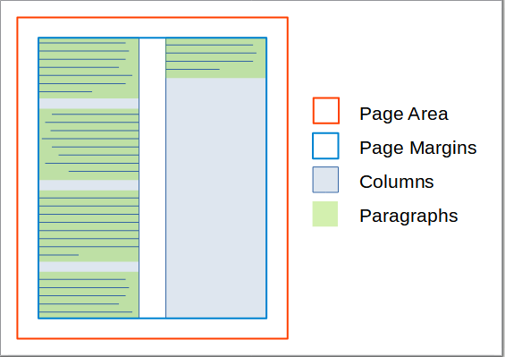

_New in [:octicons-tag-24: 2.7.6](https://github.com/py-pdf/fpdf2/blob/master/CHANGELOG.md)_
# Text Flow Regions #

**Notice:** As of fpdf2 release 2.7.6, this is an experimental feature. Both the API and the functionality may change before it is finalized, without prior notice.

Text regions are a hierarchy of classes that enable to flow text within a given outline. In the simplest case, it is just the running text column of a page. But it can also be a sequence of outlines, such as several parallel columns or the cells of a table. Other outlines may be combined by addition or subtraction to create more complex shapes. 

There are two general categories of regions. One defines boundaries for running text that will just continue in the same manner one the next page. Those include columns and tables. The second category are distinct shapes. Examples would be a circle, a rectangle, a polygon of individual shape or even an image. They may be used individually, in combination, or to modify the outline of a multipage column. Shape regions will typically not cause a page break when they are full. In the future, a possibility to chain them may be implemented, so that a new shape will continue with the text that didn't fit into the previous one.

The currently implemented text regions are:
* [Text Columns](TextColumns.html)

Other types like Table cells, shaped regions and combinations are still in the design phase, see [Quo vadis, .write()?](https://github.com/py-pdf/fpdf2/discussions/339).

## General Operation ##

Using the different region types and combination always follows the same pattern. The main difference to the normal `FPDF.write()` method is that all added text will first be buffered, and only gets rendered on the page when the context of the region is closed. This is necessary so that text can be aligned within the given boundaries even if its font, style, or size are arbitrarily varied along the way.

* Create the region instance with an `FPDF` method, , for example [text_columns()](https://py-pdf.github.io/fpdf2/fpdf/fpdf.html#fpdf.fpdf.text_columns).
<!--
* future: (_If desired, add or subtract other shapes from it (with geometric regions)_).
-->
* Use the `.write()` method of this text region in order to feed text into its buffer.
* Best practise is to use the region instance as a context manager for filling.
    * Text will be rendered automatically after closing the context.
    * When used as a context manager, you can change all text styling parameters within that context, and they will be used by the added text, but won't leak to the surroundings
* Alternatively, eg. for filling a single column of text with the already existing settings, just use the region instance as is. In that case, you'll have to explicitly use the `render()` method after adding the text.
* Within a region, paragraphs can be inserted. The primary purpose of a paragraph is to apply a different horizontal alignment than the surrounding text. It is also possible to apply margins to the top and bottom of each paragraph.

The graphic shows the relationship of page, text areas and paragraphs (with varying alignment) for the example of a two-column layout.

### Text Start Position ###

When rendering, the vertical start position of the text will be at the lowest one out of:
* the current y position
* the top of the region (if it has a defined top)
* the top margin of the page.

The horizontal start position will be either at the current x position, if that lies within the boundaries of the region/column, or at the left edge of the region.
In both horizontal and vertical positioning, regions with multiple columns may follow additional rules and restrictions.

### Interaction between Regions ###

Several region instances can exist at the same time. But only one of them can act as context manager at any given time. It is not currently possible to activate them recursively. But it is possible to use them intermittingly. This will probably most often make sense between a columnar region and a table or a graphic. You may have some running text ending at a given height, then insert a table/graphic, and finally continue the running text at the new height below the table within the existing column(s).

### Common parameters ###

All types of text regions have the following constructor parameters in common:

* text (str, optional) - text content to add to the region. This is a convenience parameter for cases when all text is available in one piece, and no partition into paragraphs (possibly with different parameters) is required. (Default: None)
* text_align (Align/str, optional) - the horizontal alignment of the text in the region. (Default: Align.L)
* line_height (float, optional) - This is a factor by which the line spacing will be different from the font height. It works similar to the attribute of the same name in HTML/CSS. (default: 1.0)
* print_sh (bool, optional) - Treat a soft-hyphen (\\u00ad) as a printable character, instead of a line breaking opportunity. (Default: False)
* skip_leading_spaces (default: False) - This flag is primarily used by `write_html()`, but may also have other uses. It removes all space characters at the beginning of each line.
* wrapmode (default "WORD") - 

All of those values can be overriden for each individual paragraph.

### Common methods ###

* `.paragraph()` [see characteristics parameters below] - establish a new paragraph in the text. The text added to this paragraph will start on a new line.
* `.write(text: str, link: = None)` - write text to the region. This is only permitted when no explicit paragraph is currently active.
* `.ln(h: float = None)` - Start a new line moving either by the current font height or by the parameter "h". Only permitted when no explicit paragraph is currently active.
* `.render()` - if the region is not used as a context manager with "with", this method must be called to actually process the added text.

## Paragraphs ##

The primary purpose of paragraphs is to enable variations in horizontal text alignment, while the horizontal extents of the text are managed by the text region. To set the alignment, you can use the `align` argument when creating the paragraph. Valid values are defined in the [`Align enum`](https://py-pdf.github.io/fpdf2/fpdf/enums.html#fpdf.enums.Align).

For more typographical control, you can use the following arguments. Most of those override the settings of the current region when set, and default to the value set there.

* text_align (Align, optional) - The horizontal alignment of the paragraph.
* line_height (float, optional) - factor by which the line spacing will be different from the font height. (default: by region) 
* top_margin (float, optional) -  how much spacing is added above the paragraph. No spacing will be added at the top of the paragraph if the current y position is at (or above) the top margin of the page. (Default: 0.0)
* bottom_margin (float, optional) - Those two values determine how much spacing is added below the paragraph. No spacing will be added at the bottom if it would result in overstepping the bottom margin of the page. (Default: 0.0)
* skip_leading_spaces (float, optional) - removes all space characters at the beginning of each line.
* wrapmode (WrapMode, optional)

Other than text regions, paragraphs should always be used as context managers and never be reused. Violating those rules may result in the entered text turning up on the page out of sequence.

### Possible future extensions

Those features are currently not supported, but Pull Requests are welcome to implement them:

* per-paragraph indentation
* first-line indentation
