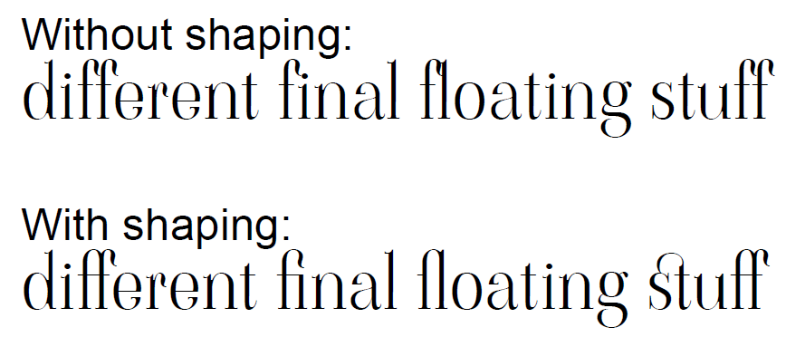
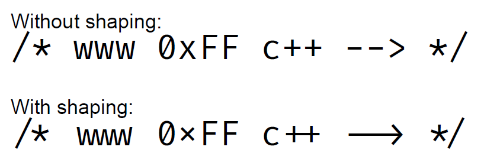

# Text Shaping #

_New in [:octicons-tag-24: 2.7.5](https://github.com/py-pdf/fpdf2/blob/master/CHANGELOG.md)_

## What is text shaping? ##
Text shaping is a fundamental process in typography and computer typesetting that influences the aesthetics and readability of text in various languages and scripts. It involves the transformation of Unicode text into glyphs, which are then positioned for display or print. 

For texts in latin script, text shaping can improve the aesthetics by replacing characters that would colide or overlap by a single glyph specially crafted to look harmonious.



This process is especially important for scripts that require complex layout, such as Arabic or Indic scripts, where characters change shape depending on their context.

There are three primary aspects of text shaping that contribute to the overall appearance of the text: kerning, ligatures, and glyph substitution.


### Kerning ###
Kerning refers to the adjustment of space between individual letter pairs in a font. This process is essential to avoid awkward gaps or overlaps that may occur due to the default spacing of the font. By manually or programmatically modifying the kerning, we can ensure an even and visually pleasing distribution of letters, which significantly improves the readability and aesthetic quality of the text.


### Ligatures ###
Ligatures are special characters that are created by combining two or more glyphs. This is frequently used to avoid collision between characters or to adhere to the typographic traditions. For instance, in English typography, the most common ligatures are "fi" and "fl", which are often fused into single characters to provide a more seamless reading experience.


### Glyph Substitution ###
Glyph substitution is a mechanism that replaces one glyph or a set of glyphs with one or more alternative glyphs. This is a crucial aspect of text shaping, especially for complex scripts where the representation of a character can significantly vary based on its surrounding characters. For example, in Arabic script, a letter can have different forms depending on whether it's at the beginning, middle, or end of a word.

Another common use of glyph substitution is to replace a sequence of characters by a symbol that better represent the meaning of those characters on a specialized context (mathematical, programming, etc.).




## Usage ##
Text shaping is disabled by default to keep backwards compatibility, reduce resource requirements and not make uharfbuzz a hard dependency.

If you want to use text shaping, the first step is installing the uharfbuzz package via pip.

```python
pip install uharfbuzz
```

⚠️ Text shaping is *not* available for type 1 fonts.

### Basic usage ###
The method `set_text_shaping()` is used to control text shaping on a document. The only mandatory argument, `use_shaping_engine` can be set to `True` to enable the shaping mechanism or `False` to disable it.

```python
pdf = FPDF()
pdf.add_page()
pdf.add_font(family="ViaodaLibre", fname=HERE / "ViaodaLibre-Regular.ttf")
pdf.set_font("ViaodaLibre", size=40)
pdf.set_text_shaping(True)
pdf.cell(txt="final soft stuff")
pdf.output("Example.pdf")
```

### Features ###
On most languages, Harfbuzz enables all features by default. If you want to enable or disable a specific feature you can pass a dictionary containing the 4 digit OpenType feature code as key and a boolean value to indicate if it should be enabled or disable.

Example:
```python
pdf.set_text_shaping(use_shaping_engine=True, features={"kern": False, "liga": False})
```

The full list of OpenType feature codes can be found [here](https://learn.microsoft.com/en-us/typography/opentype/spec/featuretags)

### Additional options ###
To perform the text shaping, harfbuzz needs to know some information like the language and the direction (right-to-left, left-to-right, etc) in order to apply the correct rules. Those information can be guessed based on the text being shaped, but you can also set the information to make sure the correct rules will be applied.

Examples:
```python
pdf.set_text_shaping(use_shaping_engine=True, direction="rtl", script="arab", language="ara")
```
```python
pdf.set_text_shaping(use_shaping_engine=True, direction="ltr", script="latn", language="eng")
```

Direction can be `ltr` (left to right) or `rtl` (right to left). The `ttb` (top to bottom) and `btt` (bottom to top) directions are not supported by fpdf2 for now.

[Valid OpenType script tags](https://learn.microsoft.com/en-us/typography/opentype/spec/scripttags)

[Valid OpenType language codes](https://learn.microsoft.com/en-us/typography/opentype/spec/languagetags)