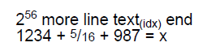

# Text styling #

## set_font() ##

Setting emphasis on text can be controlled by using `set_font(style=...)`:

* `style="B"` indicates **bold**
* `style="I"` indicates _italics_
* `style="U"` indicates <u>underline</u>
* `style="BI"` indicates _**bold italics**_

```python
from fpdf import FPDF

pdf = FPDF()
pdf.add_page()
pdf.set_font("Times", size=36)
pdf.cell(txt="This")
pdf.set_font(style="B")
pdf.cell(txt="is")
pdf.set_font(style="I")
pdf.cell(txt="a")
pdf.set_font(style="U")
pdf.cell(txt="PDF")
pdf.output("style.pdf")
```

## .set_stretching(stretching=100) ##

Text can be stretched horizontally with this setting, measured in percent.
If the argument is less than 100, then all characters are rendered proportionally narrower and the text string will take less space.
If it is larger than 100, then the width of all characters will be expanded accordingly.

The example shows the same text justified to the same width, with stretching values of 100 and 150.
```python
pdf = FPDF()
pdf.add_page()
pdf.set_font("Helvetica", "", 8)
pdf.set_fill_color(255, 255, 0)
pdf.multi_cell(w=50, txt=LOREM_IPSUM[:100], new_x="LEFT", fill=True)
pdf.ln()
pdf.set_stretching(150)
pdf.multi_cell(w=50, txt=LOREM_IPSUM[:100], new_x="LEFT", fill=True)
```


## .set_char_spacing(spacing=0) ##

This method changes the distance between individual characters of a test string. Normally, characters are placed at a given distance according the width information in the font file. If spacing is larger than 0, then their distance will be larger, creating a gap in between. If it is less than 0, then their distance will be smaller, possibly resulting in an overlap. The change in distance is given in typographic points (Pica), which makes it easy to adapt it relative to the current font size.

Character spacing works best for formatting single line text created by any method, or for highlighting individual words included in a block of text with `.write()`.

**Limitations**: Spacing will only be changed *within* a sequence of characters that `fpdf2` adds to the PDF in one go. This means that there will be no extra distance _eg._ between text parts that are placed successivly with `write()`. Also, if you apply different font styles using the Markdown functionality of `.cell()` and `.multi_cell()` or by using `html_write()`, then any parts given different styles will have the original distance between them. This is so because `fpdf2` has to add each styled fragment to the PDF file seperately.

The example shows the same text justified to the same width, with char_spacing values of 0 and 10 (font size 8 pt).
```python
pdf = FPDF()
pdf.add_page()
pdf.set_font("Helvetica", "", 8)
pdf.set_fill_color(255, 255, 0)
pdf.multi_cell(w=150, txt=LOREM_IPSUM[:200], new_x="LEFT", fill=True)
pdf.ln()
pdf.set_char_spacing(10)
pdf.multi_cell(w=150, txt=LOREM_IPSUM[:200], new_x="LEFT", fill=True)
```


## Subscript, Superscript, and Fractional Numbers

The class attribute `.char_vpos` controls special vertical positioning modes for text:

* "LINE" - normal line text (default)
* "SUP" - superscript (exponent)
* "SUB" - subscript (index)
* "NOM" - nominator of a fraction with "/"
* "DENOM" - denominator of a fraction with "/"

For each positioning mode there are two parameters that can be configured.
The defaults have been set to result in a decent layout with most fonts, and are given in parens.

The size multiplier for the font size:

* `.sup_scale` (0.7)
* `.sub_scale` (0.7)
* `.nom_scale` (0.75)
* `.denom_scale` (0.75)

The lift is given as fraction of the unscaled font size and indicates how much the glyph gets lifted above the base line (negative for below):

* `.sup_lift` (0.4)
* `.sub_lift` (-0.15)
* `.nom_lift` (0.2)
* `.denom_lift` (0.0)

**Limitations:** The individual glyphs will be scaled down as configured. This is not typographically correct, as it will also reduce the stroke width, making them look lighter than the normal text.
Unicode fonts may include characters in the [subscripts and superscripts range](https://en.wikipedia.org/wiki/Unicode_subscripts_and_superscripts). In a high quality font, those glyphs will be smaller than the normal ones, but have a proportionally stronger stroke width in order to maintain the same visual density. If available in good quality, using Characters from this range is preferred and will look better. Unfortunately, many fonts either don't (fully) cover this range, or the glyphs are of unsatisfactory quality. In those cases, this feature of `fpdf2` offers a reliable workaround with suboptimal but consistent output quality.

Practical use is essentially limited to `.write()` and `html_write()`.
The feature does technically work with `.cell()` and `.multi_cell`, but is of limited usefulness there, since you can't change font properties in the middle of a line (there is no markdown support). It currently gets completely ignored by `.text()`.

The example shows the most common use cases:

```python
    pdf = fpdf.FPDF()
    pdf.add_page()
    pdf.set_font("Helvetica", "", 20)
    pdf.write(txt="2")
    pdf.char_vpos = "SUP"
    pdf.write(txt="56")
    pdf.char_vpos = "LINE"
    pdf.write(txt=" more line text")
    pdf.char_vpos = "SUB"
    pdf.write(txt="(idx)")
    pdf.char_vpos = "LINE"
    pdf.write(txt=" end")
    pdf.ln()
    pdf.write(txt="1234 + ")
    pdf.char_vpos = "NOM"
    pdf.write(txt="5")
    pdf.char_vpos = "LINE"
    pdf.write(txt="/")
    pdf.char_vpos = "DENOM"
    pdf.write(txt="16")
    pdf.char_vpos = "LINE"
    pdf.write(txt=" + 987 = x")
```



## .text_mode ##

The PDF spec defines several text modes:


The text mode can be controlled with the `.text_mode` attribute.
With `STROKE` modes, the line width is induced by `.line_width`,
and its color can be configured with [`set_draw_color()`](fpdf/fpdf.html#fpdf.fpdf.FPDF.set_draw_color).
With `FILL` modes, the filling color can be controlled by [`set_fill_color()`](fpdf/fpdf.html#fpdf.fpdf.FPDF.set_fill_color)
or [`set_text_color()`](fpdf/fpdf.html#fpdf.fpdf.FPDF.set_text_color).

With any of the 4 `CLIP` modes, the letters will be filled by vector drawings made afterwards,
as can be seen in this example:

```python
from fpdf import FPDF

pdf = FPDF(orientation="landscape")
pdf.add_page()
pdf.set_font("Helvetica", size=100)

with pdf.local_context(text_mode="STROKE", line_width=2):
    pdf.cell(txt="Hello world")
# Outside the local context, text_mode & line_width are reverted
# back to their original default values
pdf.ln()

with pdf.local_context(text_mode="CLIP"):
    pdf.cell(txt="CLIP text mode")
    for r in range(0, 250, 2):  # drawing concentric circles
        pdf.circle(x=130-r/2, y=70-r/2, r=r)

pdf.output("text-modes.pdf")
```


More examples from [`test_text_mode.py`](https://github.com/PyFPDF/fpdf2/blob/master/test/text/test_text_mode.py):

* [text_modes.pdf](https://github.com/PyFPDF/fpdf2/blob/master/test/text/text_modes.pdf)
* [clip_text_modes.pdf](https://github.com/PyFPDF/fpdf2/blob/master/test/text/clip_text_modes.pdf)


## markdown=True ##

An optional `markdown=True` parameter can be passed to the [`cell()`](fpdf/fpdf.html#fpdf.fpdf.FPDF.cell)
& [`multi_cell()`](fpdf/fpdf.html#fpdf.fpdf.FPDF.multi_cell) methods
in order to enable basic Markdown-like styling: `**bold**, __italics__, --underlined--`

Bold & italics require using dedicated fonts for each style.

For the standard fonts (Courier, Helvetica & Times), those dedicated fonts are configured by default:

```python
from fpdf import FPDF

pdf = fpdf.FPDF()
pdf.add_page()
pdf.set_font("Times", size=60)
pdf.cell(txt="**Lorem** __Ipsum__ --dolor--", markdown=True)
pdf.output("markdown-styled.pdf")
```

Using other fonts means that their variants (bold, italics)
must be registered using `add_font` with `style="B"` and `style="I"`.
Several unit tests in `test/text/` demonstrate that:
* [test_cell_markdown_with_ttf_fonts](https://github.com/PyFPDF/fpdf2/blob/2.6.1/test/text/test_cell.py#L155)
* [test_multi_cell_markdown_with_ttf_fonts](https://github.com/PyFPDF/fpdf2/blob/2.6.1/test/text/test_multi_cell_markdown.py#L27)


## write_html ##

[`write_html`](HTML.md) allows to set emphasis on text through the `<b>`, `<i>` and `<u>` tags:

```python
pdf.write_html("""<B>bold</B>
                  <I>italic</I>
                  <U>underlined</U>
                  <B><I><U>all at once!</U></I></B>"""
)
```
