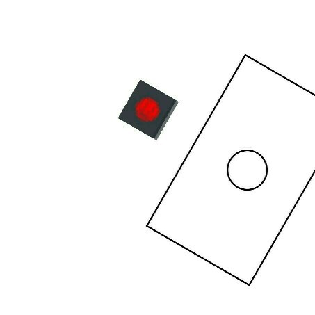
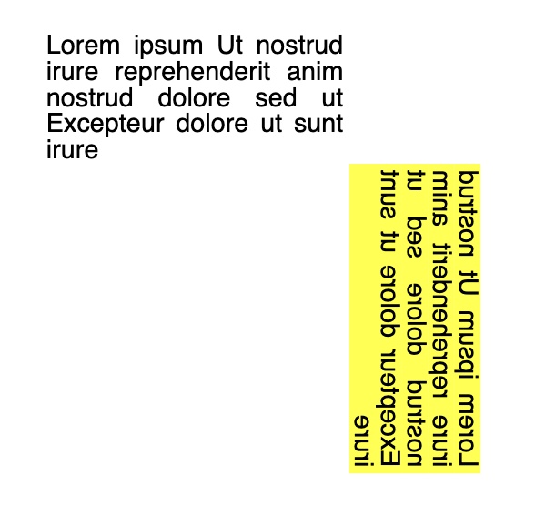

# Transformations #

## Rotation ##
The [`rotation()`](fpdf/fpdf.html#fpdf.fpdf.FPDF.rotation) context-manager
will apply a rotation to all objects inserted in its indented block:
```python
from fpdf import FPDF

pdf = FPDF(format=(40, 40))
pdf.add_page()
x, y = 15, 15
with pdf.rotation(60, x=x, y=y):
    pdf.circle(x=x, y=y+15, r=5)
    # Inserting a small base64-encoded image:
    pdf.image("data:image/png;base64,iVBORw0KGgoAAAANSUhEUgAAABAAAAAQBAMAAADt3eJSAAAAMFBMVEU0OkArMjhobHEoPUPFEBIuO0L+AAC2FBZ2JyuNICOfGx7xAwTjCAlCNTvVDA1aLzQ3COjMAAAAVUlEQVQI12NgwAaCDSA0888GCItjn0szWGBJTVoGSCjWs8TleQCQYV95evdxkFT8Kpe0PLDi5WfKd4LUsN5zS1sKFolt8bwAZrCaGqNYJAgFDEpQAAAzmxafI4vZWwAAAABJRU5ErkJggg==", x=x, y=y)
    pdf.rect(x=x-10, y=y+10, w=25, h=15)
pdf.output("rotations.pdf")
```


## Skew ##

`skew` creates a skewing transformation of magnitude `ax` in the horizontal axis and `ay` in the vertical axis. The transformation originates from `x`, `y` and will use a default origin unless specified otherwise:

```python
with pdf.skew(ax=0, ay=10):
    pdf.cell(txt="text skewed on the y-axis")
```


```python
with pdf.skew(ax=10, ay=0):
    pdf.cell(txt="text skewed on the x-axis")
```


```python
pdf.set_line_width(2)
pdf.set_draw_color(240)
pdf.set_fill_color(r=230, g=30, b=180)
with pdf.skew(ax=-45, ay=0, x=100, y=170):
    pdf.circle(x=100, y=170, r=10, style="FD")
```


## Mirror ##

The `mirror` context-manager applies a mirror transformation to all objects inserted in its indented block over a given mirror line by specifying starting co-ordinate and angle.

```python
x = 100
y = 100
pdf.text(x, y, txt="mirror this text")
with pdf.mirror((x, y), "EAST"):
    pdf.set_text_color(r=255, g=128, b=0)
    pdf.text(x, y, txt="mirror this text")
```


```python
pdf.text(x, y, txt="mirror this text")
with pdf.mirror((x, y), "NORTH"):
    pdf.set_text_color(r=255, g=128, b=0)
    pdf.text(x, y, txt="mirror this text")
```


```python
prev_x, prev_y = pdf.x, pdf.y
pdf.multi_cell(w=50, txt=LOREM_IPSUM)
with pdf.mirror((pdf.x, pdf.y), "NORTHEAST"):
    # Reset cursor to mirror original multi-cell
    pdf.x = prev_x
    pdf.y = prev_y
    pdf.multi_cell(w=50, txt=LOREM_IPSUM, fill=True)
```
