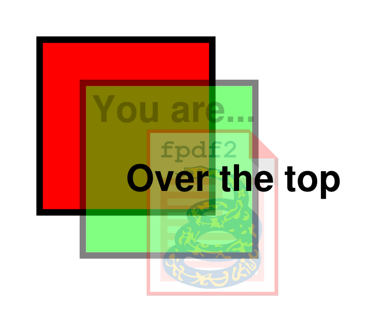

# Transparency #

The alpha opacity of [text](Text.md), [shapes](Shapes.md) and even [images](Images.md)
can be controlled through `stroke_opacity` (for lines) & `fill_opacity` (for all other content types):

```python
pdf = FPDF()
pdf.set_font("Helvetica", "B", 24)
pdf.set_line_width(1.5)
pdf.add_page()

# Draw an opaque red square:
pdf.set_fill_color(255, 0, 0)
pdf.rect(10, 10, 40, 40, "DF")

# Set alpha to semi-transparency for shape lines & filled areas:
with pdf.local_context(fill_opacity=0.5, stroke_opacity=0.5):
    # Draw a green square:
    pdf.set_fill_color(0, 255, 0)
    pdf.rect(20, 20, 40, 40, "DF")

# Set transparency for images & text:
with pdf.local_context(fill_opacity=0.25):
    # Insert an image:
    pdf.image(HERE / "../docs/fpdf2-logo.png", 30, 30, 40)
    # Print some text:
    pdf.text(22, 29, "You are...")

# Print some text with full opacity:
pdf.text(30, 45, "Over the top")

# Produce the resulting PDF:
pdf.output("transparency.pdf")
```

Results in:


